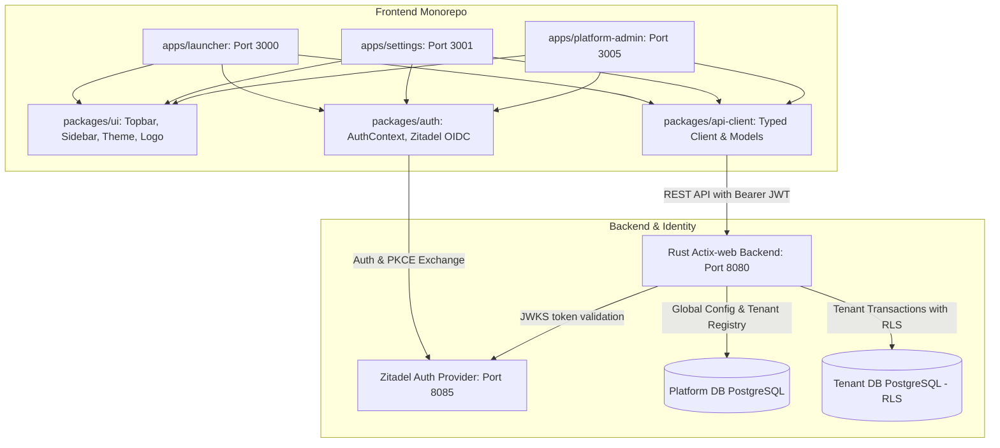

# NetGarage Platform Monolith & Micro-Frontend Architecture

## System overview

The NetGarage Platform consists of a centralized Rust Actix-web backend and a pnpm workspaces monorepo frontend hosting independent micro-frontend satellite applications.

The Platform Monolith backend hosts cross-cutting capabilities: identity, tenant provisioning, organization hierarchy (branches, departments, teams, users), RBAC roles and permissions, feature flags, billing, notifications, audit logging, file metadata, notes and entity attachments, and workflow orchestrations.

Frontend satellite applications (Launcher, Admin Settings, CRM, HRMS, Inventory, Analytics) run on dedicated ports and consume shared packages for UI, authentication, and API models.

## Technology stack

- **Backend**: Rust (Actix-web, SQLx, Actix-CORS, Tracing-Subscriber, jsonwebtoken).
- **Frontend Framework**: Next.js 16 (React 19, TypeScript, TailwindCSS v4).
- **Monorepo Manager**: `pnpm` workspaces + Turborepo.
- **Design System & Styling**: Vanilla CSS custom properties (`packages/ui/src/theme.css`), Tailwind utility classes, Lucide React icons.
- **Authentication/Identity**: Zitadel (OAuth 2.0 / PKCE Flow, JWKS verification).
- **Database**: PostgreSQL (split into `platform` and `tenant` databases with Row-Level Security).
- **Infrastructure**: Docker & Docker Compose.

## Frontend monorepo components

1. **`packages/ui` (`@netgarage/ui`)**:
   - `Topbar`: Full-width universal suite header with 9-dot app switcher, universal search trigger (Cmd+K), notifications indicator, profile management, and embedded brand vector logo.
   - `AppSidebar`: Collapsible sidebar sitting below Topbar, featuring hover-activated morphing header icon toggle and hash-aware active link tracking.
   - `AppSwitcher`: 9-dot dropdown overlay for fast switching across satellite suite apps.
   - `Logo` / `NetGarageLogo`: Pure SVG brand vector component with customizable size and fill.
   - `theme.css`: Canonical design tokens featuring clean canvas (`--canvas-default`, `--canvas-subtle`), dark grey interactive states (`--interactive-primary: #18181b`), and NetGarage brand orange (`--brand-primary: #ff5810`).
2. **`packages/auth` (`@netgarage/auth`)**:
   - Centralized authentication context provider (`AuthProvider`, `useAuth`) providing session tokens, user identity, and logout routines.
3. **`packages/api-client` (`@netgarage/api-client`)**:
   - Strongly-typed API client wrapper interfacing with the backend for branches, departments, teams, users, roles, permissions, billing, flags, audit logs, workflows, and CRM entities.
4. **`apps/launcher`**:
   - `Business+` suite launchpad application (Port 3000) showcasing active and upcoming enterprise applications.
5. **`apps/settings`**:
   - `Admin Settings` console (Port 3001) for organization topology, RBAC, billing, workflows, audit logs, feature flags, and security policies.
6. **`apps/crm`**:
   - `CRM & Sales Hub` application (Port 3002) for leads, contacts, organizations, opportunities, quotes, and sales intelligence. Foundation layer and core entity CRUD active; pipeline, notes, attachments, and EntityView in place.
   - `EntityView`: Shared, metadata-driven entity renderer in `packages/ui` used by CRM to render any entity type through configurable sections, including platform-powered Notes and Files sections.

## Backend services & endpoints

- `/api/v1/platform/tenants`: Tenant onboarding and registration.
- `/api/v1/platform/apps`: System application registry.
- `/api/v1/platform/audit`: Auditable event logging.
- `/api/v1/platform/billing`: Subscription configuration and webhooks.
- `/api/v1/platform/flags`: Feature flags evaluation.
- `/api/v1/platform/files`: File upload presigning and metadata persistence.
- `/api/v1/platform/notes`: Free-text notes attached to any entity.
- `/api/v1/platform/attachments`: File attachments linked to any entity.
- `/api/v1/platform/workflows`: Workflow orchestration engine.
- `/api/v1/auth/me`: User profile retrieval.
- `/api/v1/org/...`: Tenant-scoped organization structure (branches, departments, teams, users, roles).
- `/api/v1/crm/...`: CRM domain endpoints (entity metadata, future entity CRUD, pipelines, opportunities, quotes, etc.).

## Multi-tenancy & security boundaries

- **Row-Level Security (RLS)**: Tenant-specific tables enforce Postgres RLS via `SET LOCAL app.current_tenant_id = '<uuid>';` on each database transaction.
- **Tenant Context Extraction**: Derived by backend `TenantMiddleware` from HTTP header `X-Tenant-ID` or authenticated user claims.

## Deployment & local run

- Root script: `pnpm dev` runs satellite applications in parallel.
- Backend server: `cargo run` in `backend/`.
- Local infrastructure: `docker compose up -d` for Zitadel and PostgreSQL.
